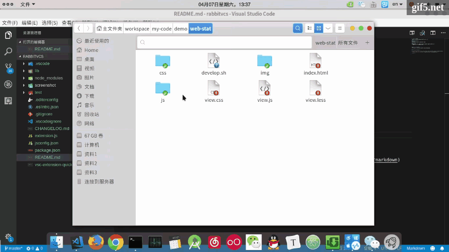
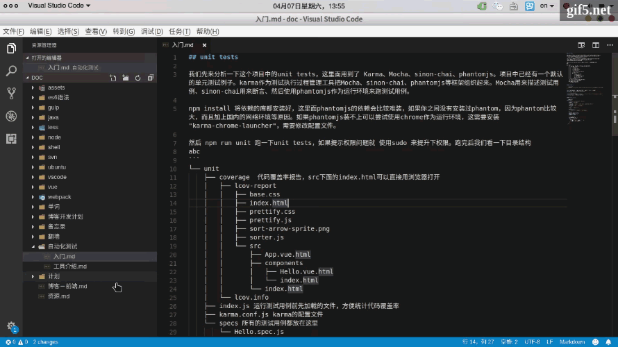
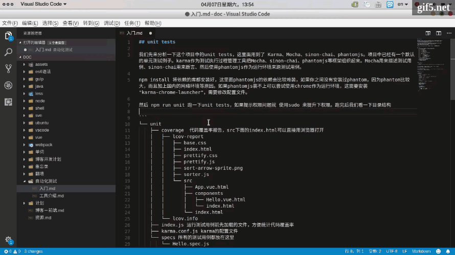
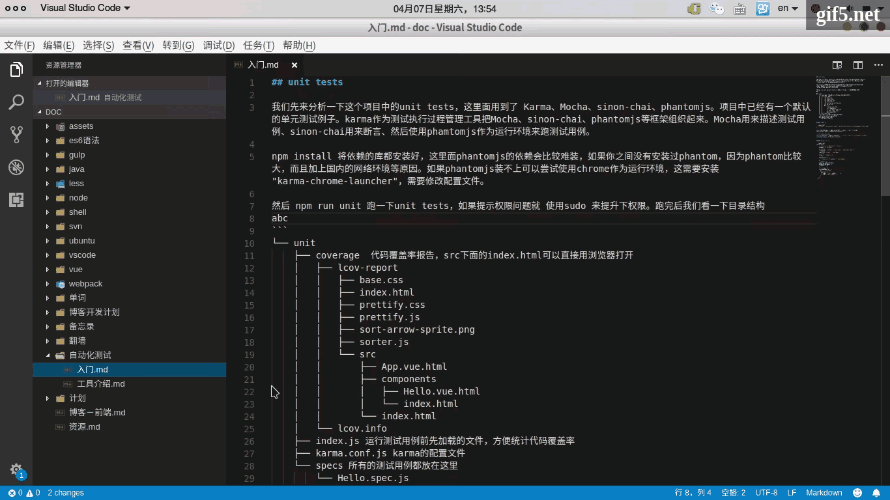

# rabbitvcs README

为了方便`vscode` 提交 `svn`代码，
rabbitvcs是linux下的tortoisesvn，使用前请先安装`rabbitvcs`。

github: https://github.com/wukuy/rabbitvcs

### Ubuntu安装rabbitvcs
### 一、添加源
sudo add-apt-repository ppa:rabbitvcs/ppa

### 二、安装包
sudo apt-get install　rabbitvcs-nautilus rabbitvcs-gedit　rabbitvcs-cli
> 安装完重启电脑,文件夹上鼠标右键就能显示显示RabbitVCS菜单

### 其他linux发行版
参考官网安装教程`rabbitvcs`:http://wiki.rabbitvcs.org/wiki/download

### 更新

### 提交

### 查看日志

